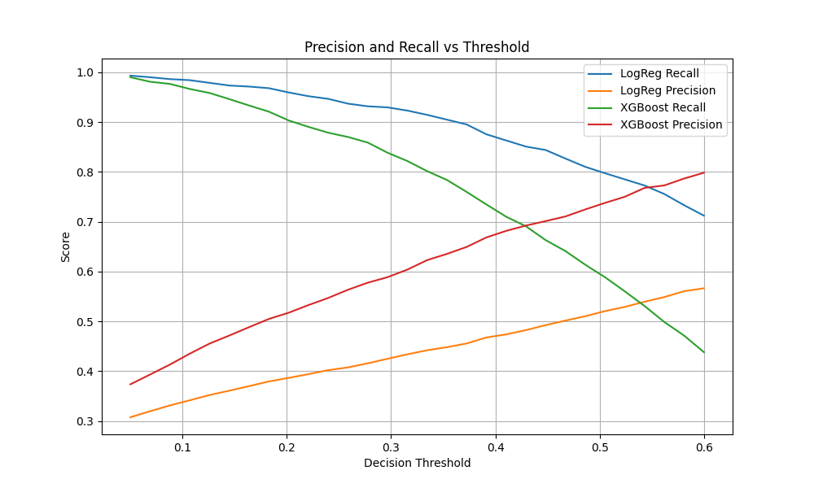
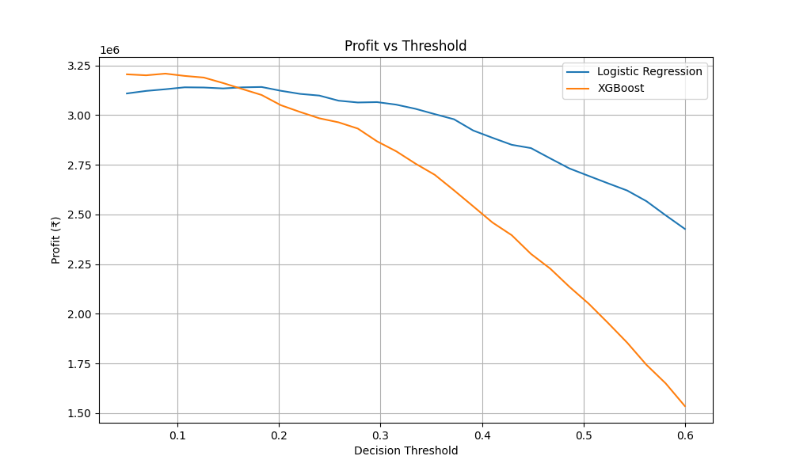
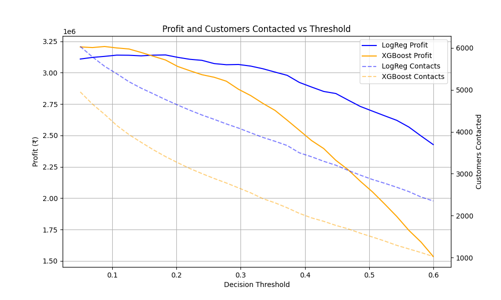

# Customer Churn Prediction & Decision Dashboard

## Executive Summary

- Built an end-to-end churn prediction system focused on **business decisions**, not just accuracy
- Compared Logistic Regression vs XGBoost using **profit-based threshold optimization**
- Integrated **cost–benefit analysis**, **SHAP explainability**, and **interactive Streamlit dashboard**
- Demonstrates applied ML, decision science, and deployment-ready thinking

## Overview

This project implements an end-to-end machine learning system for predicting customer churn and converting model predictions into actionable business decisions.

Rather than stopping at churn probability estimation, the system answers a practical question:

**Should a company intervene for a specific customer, and is that intervention economically justified?**

The project combines predictive modeling, explainability, and cost–benefit analysis into a single interactive dashboard.

---

## Problem Statement

Customer churn has a direct impact on revenue. While churn prediction models estimate the probability of churn, real-world business decisions require more than probabilities.

This project bridges the gap between:

- Machine learning predictions
- Business actions (contact vs no contact)
- Financial outcomes (profit or loss)

---

## Key Features

- Binary churn prediction using supervised learning
- Comparison of Logistic Regression and XGBoost models
- Cost-aware decision thresholds
- Cost–benefit analysis for retention actions
- Per-customer model explainability
- Interactive Streamlit web application

---

## Dataset Description

### Source

The dataset used in this project is the **Telecom Customer Churn Dataset**, originally published on **Kaggle**.
Link: https://www.kaggle.com/datasets/blastchar/telco-customer-churn?resource=download

It represents customer-level data from a telecommunications company and is widely used for churn prediction research and applied machine learning projects.

---

### Why This Dataset Was Chosen

- Realistic business problem
- Balanced mix of demographic, behavioral, and financial features
- Suitable for both:
  - Interpretable models (Logistic Regression)
  - Non-linear models (XGBoost)
- Well-aligned with churn use cases in telecom, SaaS, and subscription businesses

---

### Data Preprocessing (Summary)

- Binary target encoding
- One-hot encoding for categorical features
- Standardization for Logistic Regression only
- Stratified train–test split (80/20)

## Threshold Analysis and Cost Optimization - Models

Rather than using a fixed classification threshold (such as 0.5), this project explicitly analyzes how **different decision thresholds** affect:

- Precision and recall
- Number of customers contacted
- Number of churners saved
- Overall business profit

This allows separating **model performance** from **business decision-making**.

---

### 1. Threshold vs Precision–Recall Trade-off

#### Logistic Regression

| Threshold | Precision | Recall |
| --------- | --------- | ------ |
| 0.20      | 0.386     | 0.961  |
| 0.30      | 0.427     | 0.929  |
| 0.40      | 0.472     | 0.870  |
| 0.50      | 0.519     | 0.801  |

**Interpretation:**

- Very high recall at low thresholds
- Precision improves as threshold increases
- Suitable when missing churners is very costly

---

#### XGBoost

| Threshold | Precision | Recall |
| --------- | --------- | ------ |
| 0.20      | 0.516     | 0.904  |
| 0.30      | 0.592     | 0.835  |
| 0.40      | 0.673     | 0.724  |
| 0.50      | 0.735     | 0.596  |

**Interpretation:**

- Better precision than Logistic Regression at all thresholds
- More balanced precision–recall trade-off
- Better discrimination ability (higher ROC AUC)

---

### 2. Cost Model Assumptions

To translate predictions into business decisions, the following assumptions are used:

- **Cost to contact a customer** (marketing / call center)
- **Value of a retained customer**
- **Retention success rate** (probability that a contacted churner stays)

These parameters are configurable and **not hard-coded into the model**.

---

### 3. Profit Optimization Results

#### Logistic Regression – Profit by Threshold

- Maximum profit achieved around **threshold ≈ 0.18**
- Profit peak: **≈ ₹3.14 million**
- Contacts a large number of customers (~4,700–5,000)
- Saves many churners, but with higher contact costs

This model favors **aggressive intervention**.

---

#### XGBoost – Profit by Threshold

- Maximum profit achieved around **threshold ≈ 0.09**
- Profit peak: **≈ ₹3.21 million**
- Contacts fewer customers than Logistic Regression
- Achieves similar churn savings with lower operational cost

This model is **more cost-efficient**.

---

### 4. Model Comparison (Business Perspective)

| Aspect              | Logistic Regression | XGBoost |
| ------------------- | ------------------- | ------- |
| Optimal threshold   | ~0.18               | ~0.09   |
| Max profit          | ~₹3.14M             | ~₹3.21M |
| Customers contacted | High                | Lower   |
| Cost efficiency     | Moderate            | High    |

---

### 5. SHAP

The following SHAP summary plot shows the most influential features driving churn predictions across the dataset.

Features such as contract type, tenure, and internet service consistently dominate churn risk across customers.

### Key Conclusions

- A fixed probability threshold (e.g., 0.5) is rarely optimal for churn prediction and should not be treated as a default decision rule.
- Effective churn interventions require **cost-sensitive threshold selection**, not optimization of accuracy metrics alone.
- Under the assumed cost model, XGBoost achieves higher expected profit while requiring fewer customer interventions than Logistic Regression.
- Decision threshold optimization is a critical component of applied machine learning systems and can be as impactful as model selection itself.

---

## Streamlit Decision Dashboard

An interactive **Streamlit web application** demonstrates how churn predictions are converted into **business decisions**, rather than stopping at probability estimation.

The dashboard allows users to:

- Select a trained model (Logistic Regression or XGBoost)
- Evaluate an existing customer or manually input customer details
- Configure business parameters (contact cost, customer value, retention success rate)
- Apply probability thresholds to decide whether to intervene
- View the expected profit or loss for each decision

The application explicitly **separates prediction from decision logic**:

- Models output churn probabilities
- Business rules determine actions and financial outcomes
- Thresholds and costs can be adjusted without retraining models

Model transparency is ensured through:

- Coefficient-based explanations for Logistic Regression
- SHAP-based explanations for XGBoost

This dashboard illustrates how machine learning models can support **interpretable, cost-aware decision-making** in a real-world setting.

## Deployment

This Streamlit app is deployed at: https://customer-churn-telecom-prediction.streamlit.app/

## Demo

## MLOps

MLflow was used during experimentation to track runs, compare models, and store artifacts.

---

## Project Structure

The repository is organized to clearly separate concerns and support maintainability.

customer_churn/
│
├── data/
│ ├── raw/ # Original Kaggle dataset
│ └── processed/ # Cleaned and feature-engineered data
│
├── models/
│ ├── xgboost.pkl # Final XGBoost model
│ └── logreg.pkl # Final Logistic Regression model
│
├── src/
│ ├── data/ # Data loading and preprocessing
│ ├── models/ # Model training scripts
│ ├── analysis/ # Threshold, cost, SHAP, PDP analysis
| ├── features/ # build feature columns
│
├── app/
│ └── streamlit_app.py # Streamlit dashboard
│
├── reports/
│ ├── plots/ # ROC, threshold, profit plots, SHAP and PDP outputs
│
├── requirements.txt
├── README.md
└── .gitignore

---

## Key Learnings

- Accuracy and ROC-AUC are insufficient for real-world decision-making
- Optimal classification thresholds depend on business costs, not model metrics
- Tree-based models can outperform linear models economically even with similar recall
- Explainability is critical for stakeholder trust and model adoption

## Future Improvements

Several extensions could further improve the system:

- Time-based validation and retraining strategy
- Customer lifetime value (CLV) modeling
- Segment-specific retention success rates
- Automated threshold optimization inside the application
- Integration with CRM or marketing tools
- Cloud deployment with monitoring and logging
- Fairness and bias analysis

These would be natural next steps in a production environment.

---

## If you find this project useful or interesting, feel free to star the repository. Thank You!
